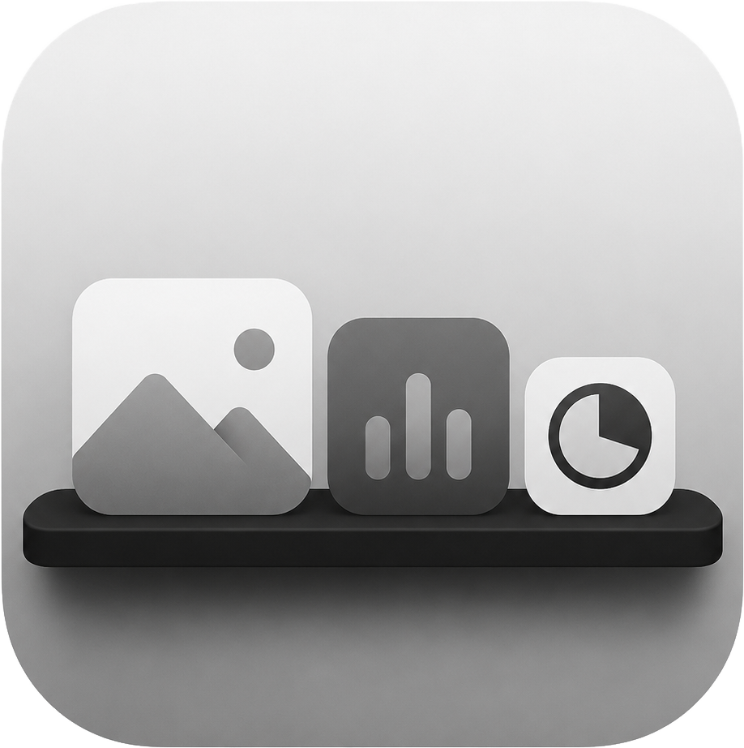

<div align="center">



# Поличка

**Док-панель для робочого столу Windows з налаштовуваними віджетами**

[](LICENSE)
[](#системні-вимоги)
[](https://dotnet.microsoft.com/)
[](https://github.com/bridges-net-ua/shelf/actions/workflows/build.yml)
[](https://github.com/bridges-net-ua/shelf/releases/latest)

[Завантажити](https://github.com/bridges-net-ua/shelf/releases/latest) ·
[Сайт](https://shelf.bridges.net.ua/) ·
[Повідомити про баг](https://github.com/bridges-net-ua/shelf/issues/new?template=bug_report.md) ·
[English README](README.en.md)

</div>

---

## Що це

**Поличка** - це бічна панель (док-бар), яка живе на правому або лівому краю екрана у Windows і тримає набір зручних мініатюрних віджетів: годинник, замітки, список задач, фото-слайдшоу, інтернет-радіо, погоду, таймер, секундомір, календар свят.

Панель резервує собі місце на екрані через Windows AppBar API - тож коли ти розгортаєш будь-яке вікно на повний екран, воно займає простір **поряд** з Поличкою, а не **під** нею.

## Скріншоти

> Скріншоти будуть додані у наступних релізах.

<!-- TODO: docs/assets/screenshot-1.png тощо -->

## Можливості

- **9 вбудованих віджетів** (детальніше нижче).
- **Темна і світла теми**, перемикання наживо без перезапуску.
- **Українська і англійська мови** інтерфейсу.
- **Приховування панелі** з виїздом по наведенню курсора.
- **Закріплення віджетів** у верхній зоні (вони не прокручуються).
- **Перетягування** для зміни порядку віджетів.
- **Збереження стану** автоматично у `%APPDATA%\Shelf\settings.json`.
- **Робота на всіх віртуальних столах** Windows.
- **Автозапуск з системою** (за бажанням).

## Віджети

| Віджет | Опис |
|---|---|
| Годинник | Час і дата у різних форматах. |
| Замітки | Текстовий блокнот з автозбереженням. |
| Список задач | To-do з підтримкою мульти-вставки і переміщення виконаних униз. |
| Слайд-шоу фото | Перегортання фотографій з папки, ефект Ken Burns. |
| Інтернет-радіо | Стрімінг радіостанцій (вбудований список + власні). |
| Погода | Поточна погода + прогноз на завтра (Open-Meteo, без API-ключа). |
| Таймер | Зворотний відлік зі звуковим сигналом. |
| Секундомір | Хвилини/секунди/мс + лапи. |
| Свята | Календар державних, релігійних і ваших власних свят на 3 дні (вчора/сьогодні/завтра). |

## Завантаження

Готові збірки доступні на сторінці **[Releases](https://github.com/bridges-net-ua/shelf/releases/latest)**:

1. Завантажити `Shelf-vX.Y.Z-win-x64.zip`.
2. Розпакувати у будь-яку папку.
3. Запустити `Shelf.exe`.

> При першому запуску Windows SmartScreen може показати попередження «Захист Windows блокував запуск невідомого додатка» - це нормально для нових open-source застосунків без комерційного підпису коду. Натисни «Докладніше» → «Виконати все одно». Майбутні версії плануємо підписати, щоб попередження зникло.

### Системні вимоги

- Windows 10 (1809+) або Windows 11
- Архітектура x64
- ~150 МБ вільного місця

Збірка self-contained - .NET 8 встановлювати окремо не треба.

## Збірка з джерел

Якщо хочеш зібрати самостійно (наприклад, щоб додати свій віджет):

```powershell
git clone https://github.com/bridges-net-ua/shelf.git
cd shelf
dotnet build Shelf.sln -c Debug
Start-Process bin\Debug\net8.0-windows\Shelf.exe
```

Потрібен **.NET 8 SDK** ([завантажити](https://dotnet.microsoft.com/download/dotnet/8.0)).

Деталі архітектури і як писати власні віджети - у [CONTRIBUTING.md](CONTRIBUTING.md).

## Технологічний стек

- **.NET 8** (`net8.0-windows`)
- **WPF** для UI, **WinForms** для системного трею (`NotifyIcon`)
- **Win32 AppBar API** для резервування простору на екрані
- Зовнішні залежності для віджетів - **жодних** (HTTP, JSON, відтворення медіа - все через стандартну бібліотеку)

## Ліцензія

Поличка випущена під ліцензією **MIT**. Дивись повний текст у [LICENSE](LICENSE).

Коротко: можеш робити з кодом будь-що, в тому числі у комерційних продуктах, лиш зберігай у похідних роботах посилання на оригінального автора.

## Внесок у проект

Pull request-и вітаються. Перш ніж починати велику зміну - відкрий [Issue](https://github.com/bridges-net-ua/shelf/issues) для обговорення.

Деталі (як зібрати, як надсилати PR, конвенції коду) - у [CONTRIBUTING.md](CONTRIBUTING.md).

Усі учасники зобов'язуються дотримуватись [Кодексу поведінки](CODE_OF_CONDUCT.md).

## Автор і контакти

Розроблено **Bridges Community**.

- Сайт: [shelf.bridges.net.ua](https://shelf.bridges.net.ua/)
- Email: [shelf@bridges.net.ua](mailto:shelf@bridges.net.ua)
- GitHub Issues: [bridges-net-ua/shelf/issues](https://github.com/bridges-net-ua/shelf/issues)

---

<div align="center">
<sub>© 2026 Bridges Community · MIT License</sub>
</div>
